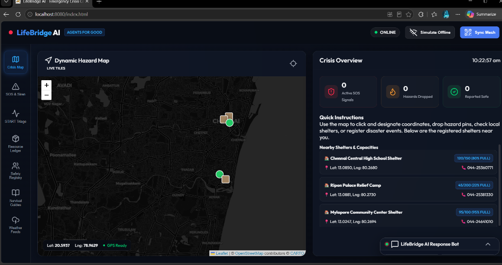
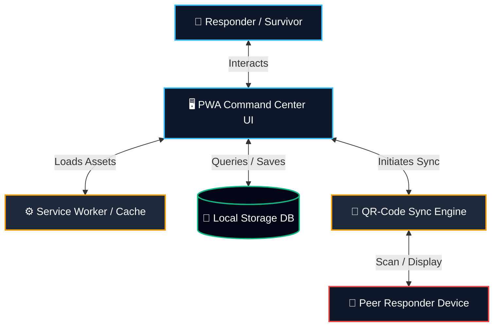
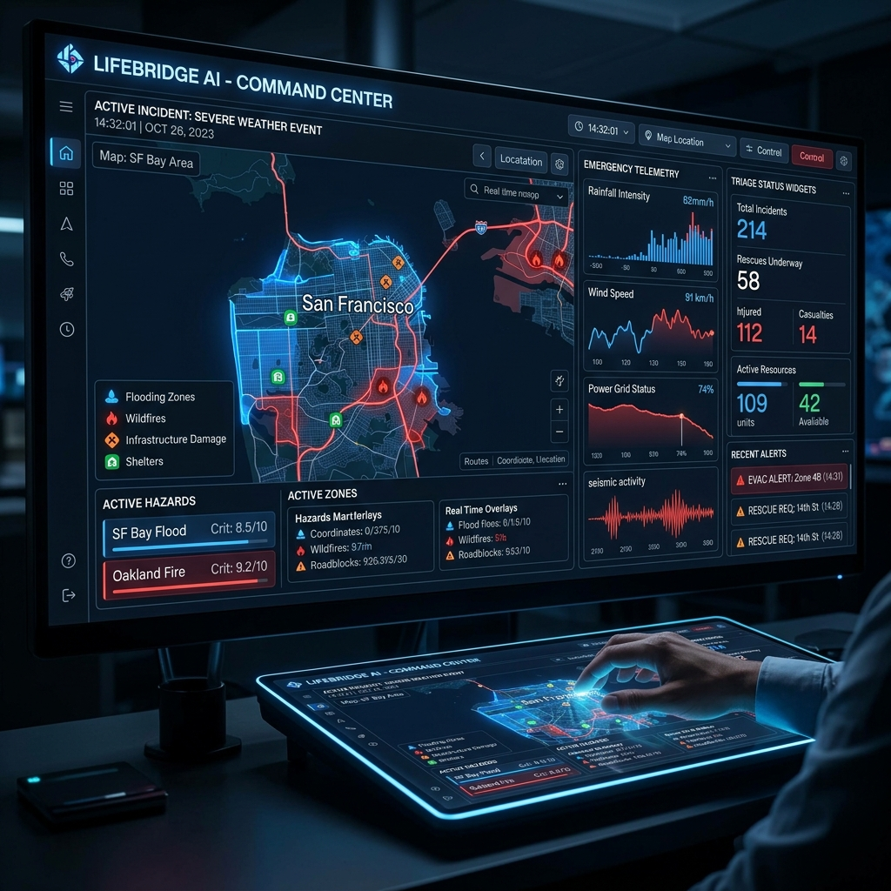
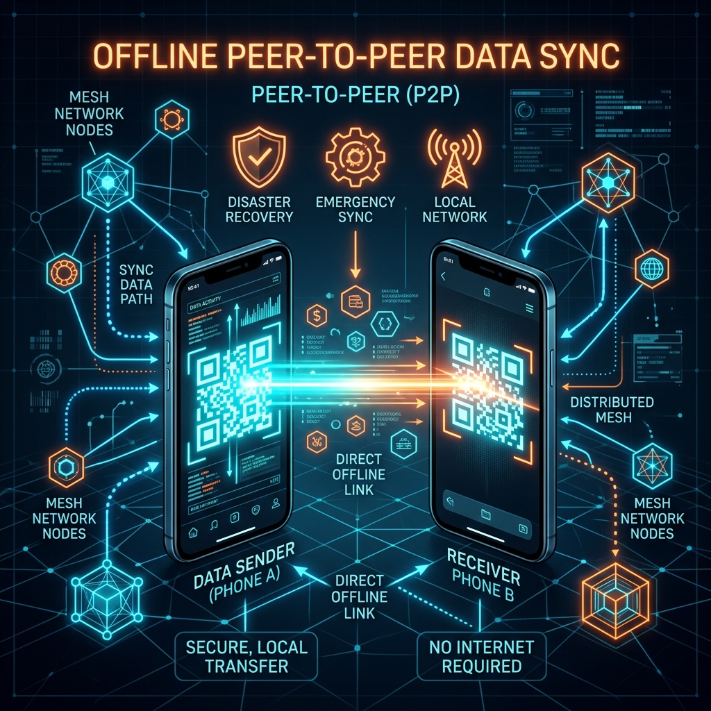

# 🌉 LifeBridge AI: Emergency Crisis Command Center

> **Offline-first command center for disaster coordination, triage, and peer-to-peer (P2P) mesh synchronization.**

LifeBridge AI is a progressive web application (PWA) designed to provide critical coordination, triage, and resource tracking tools for disaster response teams and civilians when internet connectivity is compromised. Built for resilient operation in active crisis zones, the platform relies on browser-native local storage, offline maps with grid fallbacks, and physical QR-based database synchronization to create a decentralized communication network.

---

## 🖥️ Live Project Demo

Below is the live execution of the LifeBridge AI Command Center interface showing the Offline/Online synchronization indicators, the Dynamic Hazard Map centered on active coordinates, and the real-time Crisis Overview showing shelter statuses, SOS signal counts, and active hazards.



---

## 🏗️ System Architecture & Data Flow

LifeBridge AI utilizes a completely decentralized, serverless architecture that operates entirely on client devices:



- **Service Worker Cache**: Stores HTML, CSS, JavaScript, icons, and guides to allow offline loads.
- **Local Storage Database**: Stores triage reports, resource ledgers, missing persons registry, and hazard pins locally on the device.
- **QR Sync Engine**: Converts delta updates into compressed, high-density QR codes for optical transmission, bypassing the need for network access.

---

## 📸 Workflows & System Overview

### 1. Crisis Command & Triage Management
The command center acts as a centralized dashboard to track active distress signals, hazard zones, and casualty triage statuses. In the event of Leaflet map tile failures, the system automatically falls back to a simulated vector map grid, ensuring location tracking remains functional.



### 2. Peer-to-Peer (P2P) Mesh Sync
When communication infrastructure (cellular towers, fiber, internet) fails completely, users can bridge databases by generating and scanning QR codes. This offline synchronization allows teams to merge survivor registries, resource levels, and hazard pins simply by sharing screens.



---

## 🚀 Core Features

### 🗺️ Dynamic Hazard Map & Offline Grid
- **Live Tiles**: Displays active hazards, shelters, and team coordinates using Leaflet.js when online.
- **Offline Fallback Canvas**: Automatically transitions to a simulated geometric coordinate grid if map tiles fail to load, retaining marker dropping and tracking capabilities.
- **GPS Coordinates Overlay**: Live latitude/longitude coordinate reporting with accuracy tracking.

### 🚨 Emergency Beacon Command (SOS & Siren)
- **Morse Code Siren**: Emits a high-frequency (880Hz) audio emergency signal (`... --- ...`) using the browser's Web Audio API to aid rescuers locating trapped individuals.
- **Strobe Light Beacon**: Alternates high-contrast screen flashing to serve as a visual signal in dark, smoke-filled, or rubble conditions.
- **Hazard Pin Broadcasting**: Quickly report floods, debris blocks, fallen lines, or medical needs with GPS tags.

### 🩺 S.T.A.R.T. Triage Diagnostic Wizard
- **Automated Classification**: Implements the standard *Simple Triage and Rapid Treatment* protocol.
- **Step-by-Step UI**: Evaluates Respiration, Perfusion, and Mental Status.
- **Instant Color Coding**: Automatically categorizes victims into:
  - 🟢 **Minor (Green)**
  - 🟡 **Delayed (Yellow)**
  - 🔴 **Immediate (Red)**
  - ⚫ **Deceased (Black)**

### 📦 Resource Ledger
- **Inventory Tracking**: Offline catalog of water, food, medicine, blankets, and tools.
- **Urgency Levels**: High, Medium, and Low prioritization for tracking critical supplies.
- **Fulfillment States**: Simple status toggles (Available, Pending, Depleted).

### 👥 Safety Registry
- **Missing & Safe Database**: Register displaced persons or check safe statuses.
- **Local Storage Querying**: Full offline lookup and verification of family members and team personnel.

### 📖 Survival Guides & Weather Alerts
- **Disaster Playbooks**: Built-in interactive guides for floods, fires, earthquakes, and medical emergencies.
- **Offline Weather Cache**: Caches current meteorological feeds to anticipate weather changes.

---

## 🛠️ Technical Stack & Architecture

- **Frontend**: Vanilla HTML5, CSS3 (Modern dark-mode glassmorphism, responsive grid layout).
- **Icons**: Lucide Icons.
- **Mapping**: Leaflet.js (with canvas vector fallback).
- **Service Worker**: Cache-first asset caching (`sw.js`) for full PWA support.
- **Local Storage Engine**: Structured local databases for safety logs, hazards, resources, and triage reports.
- **P2P Sync Protocol**: QR-based JSON payload compression and differential database merging.

---

## 📦 Getting Started

### Prerequisites
To run LifeBridge AI locally, you only need a modern web browser. However, a local development server is recommended for service worker functionality.

### Running Locally
1. Clone the repository:
   ```bash
   git clone https://github.com/RAGASUDHA-B/life-bridge-ai.git
   cd life-bridge-ai
   ```

2. Start a simple local server. For example, using Python:
   ```bash
   python -m http.server 8000
   ```
   Or using Node.js `http-server`:
   ```bash
   npx http-server .
   ```

3. Open `http://localhost:8000` (or the respective port) in your web browser.
4. (Optional) To enable offline installation, click **Install App** in the browser address bar to install the Progressive Web App (PWA).

---

## 🔗 How P2P Synchronization Works
1. **Local Changes**: Responders log triage cases, hazard points, or registry updates locally.
2. **Generate Sync Code**: Clicking **Sync Mesh** packages the local database delta into an optimized JSON payload and generates a high-capacity QR code.
3. **Scan & Merge**: Another device scans the QR code using its camera. The receiving device merges the remote records with its own local database, resolving conflicts based on timestamps, and propagates the updated database.
