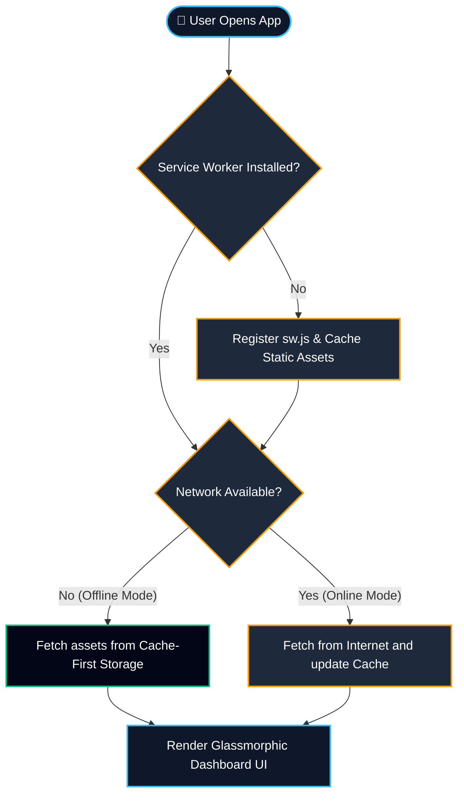
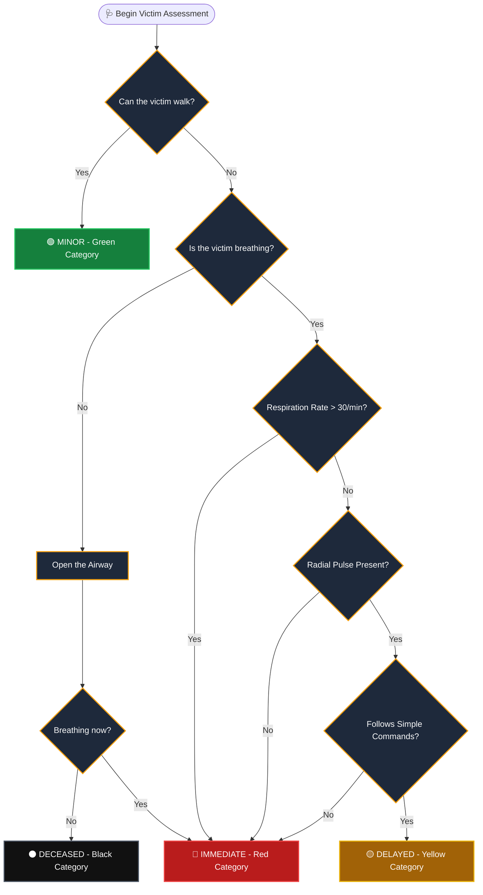
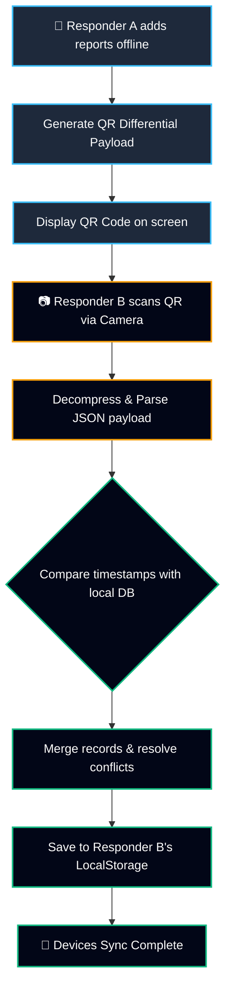

# 🌉 LifeBridge AI: Project Documentation & Workflows

## 1. Project Overview
**LifeBridge AI** is an offline-first command center Progressive Web Application (PWA) designed to assist disaster response teams, emergency workers, and survivors during crises where central communication infrastructure (cellular networks, internet, power grids) has failed. 

By utilizing browser-native technologies such as Service Workers for offline loading, LocalStorage for persistent data storage, the Web Audio API for distress signaling, and QR codes for offline peer-to-peer data syncing, LifeBridge AI provides a resilient communication and coordination tool that runs directly on standard smartphones and tablets without any active network connection.

---

## 2. Key Modules & Technical Flow Diagrams

### Flow A: PWA Offline Lifecycle & Caching Flow
This diagram illustrates how the application boots and operates without network access, using a cache-first Service Worker intercept strategy.

---

### Flow B: S.T.A.R.T. Triage Protocol Flow
The *Simple Triage and Rapid Treatment* (S.T.A.R.T.) wizard guides emergency responders through classifying casualties during mass casualty incidents.

---

### Flow C: Peer-to-Peer (P2P) Database Synchronization Flow
When local databases (Ledgers, Registries, Hazards) need to be shared across responders without network access, they utilize a QR-based mesh synchronization system.

---

## 3. Technology Stack Breakdown
1. **Application Shell (HTML5 & CSS3)**:
   - Sleek dark-mode interface utilizing modern glassmorphism.
   - Designed for high-contrast viewing under outdoor conditions.
2. **Local Storage Database (localStorage)**:
   - Local storage acts as the single source of truth when offline.
   - Manages four distinct tables: SOS Signals, Hazards Registry, Resource Ledger, and Safety Registry.
3. **Web Audio API**:
   - Generates Morse code audio beacon signals dynamically in the browser client to conserve space and avoid loading heavy MP3/WAV assets.
4. **Leaflet.js Mapping Engine**:
   - Displays geospatial coordinates.
   - Switches automatically to a custom Canvas-based geometric fallback grid when map tile servers are unreachable.
